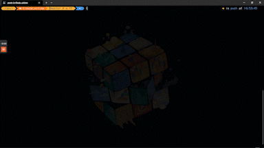

<p align="center">
  
</p>

<h1 align="center">Racing Game Baccalaureat</h1>

<div align="center">

[](https://forthebadge.com)
<br />

<div />

---

> 🟥 This is a racing game project I created during my high school diploma program. The game is similar to Mario Kart and can be played alone or with local opponents.

---

- [1. Getting Started](#1-gettingstarted)
- [2. Installation](#2-installation)
- [3. Usage](#3-usage)
- [4. Acknowledgements](#4-acknowledgements)

## 1. Getting Started

> To play the game, you need to have Python 3 installed on your computer. You can download it from the official Python website. Once you have Python 3 installed, you can download the project files from GitHub.

## 2. Installation

To install the project, follow these steps:

### 1. Clone the repository to your local machine.

```bash
git clone https://github.com/<YOUR-USERNAME>/
```

### 2. Install requirement.

```bash
pip install -r requirements.txt
```

### 3. Configure server.

Take the IPV4 address of your computer according to the network type you use. If you are on Windows type IPCONFIG in the command prompt. Otherwise type ifconfig in the control prompt for your system.This address will be use to start a server.

```bash
ipconfig
ifconfig
```

Paste the address to the line 12 of client.py in the folder Joueur1 and Joueur2

<p align="center">
  
</p>

## 2. Usage

Run the game

```bash
python ./Joueur1/server.py
python ./Joueur1/main.py
python ./Joueur2/main.py
```

### Playing Alone

The goal of the game is to complete the race as fast as possible while avoiding obstacles.

### Playing with Local Opponents

If you choose to play with local opponents, you will need to connect to other players on the same local network. Once connected,the game will begin. The goal is the same as playing alone, but you will also need to compete against the other players to cross the finish line first.

## 3. Acknowledgements

Thank you to my high school teacher, M. Jocelin Devalette who supported me during this project.
